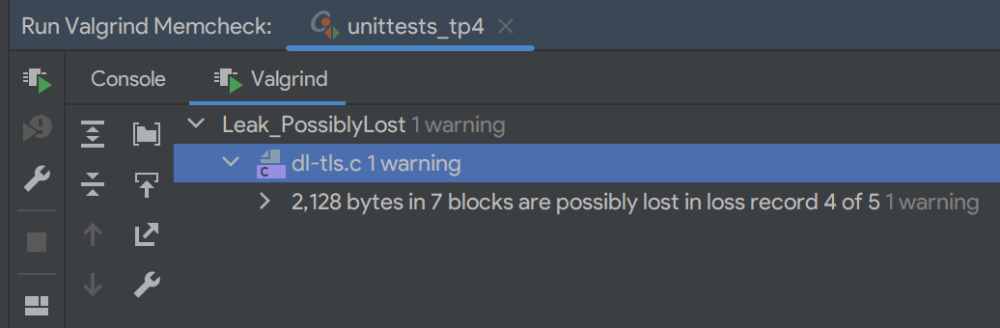

# TP4 - Range & Interval Tree

> Deadline: lundi 16 mai 13:00

## Objectifs

- Algorithme Range Tree
- Algorithme Interval Tree
- Programmation template

## Spécifications

Pour cet exercice nous allons implémenter 2 algorithmes qui utilisent des arbres binaires comme structure de données.
Vous allez réutiliser votre classe Point du TP précédent (adapter si nécessaire). Une suite de tests vous est fourni.
Complétez-la avec les tests écrits pour votre classe Point.

Ce TP sera réutilisé dans le TP5. C’est pour ceci que le code review se fait par une autre personne dans la classe.

### RangeTree

Dans un premier temps nous allons implémenter un __RangeTree__, qui lui n’utilise pas de programmation template, mais
utilise plusieurs classes qui elles sont génériques grâce à la programmation template.

Une implémentation partielle vous est donnée. Il reste à implémenter :

- RangeTree:: RangeTree
    - Constructeur
- RangeTree::build2DRangeTree
    - Méthode récursive pour construire l’arbre, utilisée par le constructeur
- RangeTree::search
    - Recherche des points dans une région

### IntervalTree

Dans un deuxième temps nous implémentons un __IntervalTree__ avec de la programmation Template. Trois classes sont à
implémenter ou compléter.

La première tâche est de créer une classe template Interval qui permet de définir un __intervalle__ avec un début et une
fin. En plus l’intervalle contient une valeur, qui peut être utilisé par la suite. Le type des coordonnées start et end
doivent être les mêmes, mais le type de la valeur stocké, peut être diffèrent (il s’agit donc d’un template avec 2
paramètres de type). Par défaut le premier paramètre est un int et le deuxième un double. Les deux paramètres doivent au
minimum marcher avec les types de bases double et int. Le fichier existe déjà (src/Inteval.h) mais est vide.

La classe doit implémenter:

- Constructeur a trois paramètres (start / end / value). Value a une valeur par défaut de 0
- Getters pour start, end et value (__getStart__ et __getEnd__, __getValue__)
- Une fonction contains qui retourne un bool qui indique si une valeur se trouve dans un des intervals définies
- Les opérateurs == et !=

La classe Interval doit utiliser la spécialisation de template. Une suggestion est de l’utiliser l’opérateur == pour
ceci (on se rappelle qu’il ne faut jamais comparer des doubles avec ==. C++ vous fournit un epsilon par défaut que vous
pouvez utiliser : __std::numeric_limits<double>::epsilon()__ )

Une implémentation partielle vous est donnée. Il reste à implémenter :

- IntervalTreeElement::IntervalTreeElement
    - Constructeur d’un élément de l’arbre d’intervalles
- IntervalTreeElement::intersecting
    - Retourne les intervalles qui intersectent un certain point (Pour un élément et ces sous éléments)
- IntervalTree::intersecting
    - Retourne les intervalles qui intersectent un certain point (pour tout l’arbre)
- IntervalTree::fromIntervals
    - Méthode récursive pour construire l’arbre, utilisé par le constructeur

### Code review

Comme le code de TP est réutilisé dans le TP5, pas de code-review est fait de la part de l’enseignant (mais il faudra
quand même suivre les exigences). En revanche, tout le monde a été attribué un/une partenaire pour faire le code-review.
Vous trouvez le nom de qui vous devez faire le code-review sur une feuille Excel disponible sur cyberlarn (Personne A
fait le review de personne B).

Le but du code-review c’est de :

- Vérifier que les exigences sont suivies
- Trouver des bugs
- Donner des conseils d’améliorations
    - Bugs, style etc.

#### Informations & Astuces:

Ce TP contient un exécutable benchmark, qui sera pertinent pour le prochain TP. Ne modifiez pas le code ou changez le
nom de l’exécutable. Il ne faut pas non plus exécuter cet exécutable dans le CI (pour ne pas surcharger le
l’infrastructure CI)._

Suivez une approche méthodique. Commencez pas vous assurer que le programme compile (même que si son comportement est
faux) et que vous pouvez exécuter les tests unitaires. Continuez par implémenter la pipeline CI et utilisez par la suite
les tests unitaires (à compléter si nécessaire) comme liste de taches.

Faites vos code-reviews avant la deadline. A deux il sera plus simple de suivre les consignes. Le processus du
code-review peut se faire d’une manière itérative. Donc vous pouvez faire des commits qui corrigent les commentaires
faits durant le code review.

## Exigences

> Chaque exigence pas respectée enlève 0.1 de la note du TP.

- [x] Les tests unitaires passent sans erreurs
    - [x] Avec les tests de Point du TP3
- [x] La spécialisation de template est utilisée
    - Suggestion: Interval ::operator== pour double (et float?)
- [x] L’exécutable benchmark (benchmark.cpp) existe et n’a pas été modifié
    - [x] L'utiliser dans la CI
- [x] Aucun fichier dans src/base n’est modifié
- [x] Le code-review de @julian.derighet a été fait
    - Voir feuille sur cyberlearn, personne A fait le review de personne B
- [x] Votre repository ne doit pas contenir des fichiers binaires et temporaires (comme le répertoire cmake-build-debug
  ou .idea)
- [x] Après chaque commit, le code compile sur le CI de gitlab avec -Wall et -Werror comme options et les tests
  unitaires
  sont exécutés
- [x] Vous travaillez sur un fork du repo original (lien sur cyberlearn) et devez créer un merge request avant la
  deadline.
    - Beat Wolf doit avoir accès à votre repository (ajouter comme membre ou mettre en public)
    - @camille.felder doit aussi avoir accès à votre repository

# TP5 - Optimisations

> Deadline: vendredi 3 juin 13:00

## Objectifs

- Utilisation de Valgrind
- Utilisation de GPerfTools
- Optimisation de code

## Spécifications

Le but de ce TP c’est de corriger d’éventuels problèmes de mémoire et d’optimiser l’application benchmark. Une copie de
l’algorithme original est donnée dans le fichier src/base/SimpleDistance.h/.cpp. Cette copie est utilisée dans le test
BenchmarkTest qui permet de vérifier que vos optimisations ne changent pas le comportement de l’algorithme.

### Memory leaks

Analysez votre code du TP4 pour voir si ils continent des memory leaks ou d’autres problèmes et corrigez les. Utilisez
valgrind et vos tests unitaires pour faire ceci.

Mettez dans le Readme de votre projet l’output final de votre test avec Valgrind qui montre qu’il n’y a pas de memory
leaks ou d’autres problèmes. Pour cette étape vous pouvez modifier tout les fichiers dans le repository (aussi ceux
fourni de base).

### Optimisations

Analysez les performances avec google-gprof (et votre propre connaissance du code) et optimisez votre code. Analysez les
performances avant et après chacun de vos changements. Utilisez le programme de benchmark fourni (benchmark.cpp) pour
faire ces mesures.

__Ne modifiez jamais benchmark.cpp. Pour faire des expériences (profilage, réduire la taille du problème), créez une
copie de ce fichier (benchmark2.cpp) et travaillez sur cette copie.__

## Exigences

Chaque exigence pas respectée enlève 0.1 de la note du TP.

- [x] Écrivez dans votre Readme.md du repository les résultats des benchmarks avant et après vos changements et l’output
  de valgrind avant et après corrections de problèmes
    - Si l’output est trop grand, mettez-le dans des fichiers annexes
- [x] Les fichiers PDFs qui montrent le profilage avant les optimisations et après
- [x] Le nom de l’exécutable du benchmark doit être « benchmark » (comme dans le CMakeList original)
    - Le code de benchmarch.cpp n’est pas modifié
- [x] Aucun fichier dans src/base est modifié
- [x] Votre repository ne doit pas contenir des fichiers binaires et temporaires (comme le répertoire cmake-build-debug
  ou .idea)
- [x] Après chaque commit, le code compile sur le CI de gitlab avec -Wall et -Werror comme options et les tests
  unitaires sont exécutés
- [x] Vous travaillez sur un fork du repo original (lien sur cyberlearn) et devez créer un merge request avant la
  deadline.
    - Beat Wolf doit avoir accès à votre repository (ajouter comme membre ou mettre en public)

## Observations

Voici les observations que j'ai pu faire sur le TP5:

### Memory leaks

Malgré un leak possible, je ne peux pas le gérer, car il ne fait pas partie des fichiers du TP.

### Optimisation

| Changement                              | benchmark(5, 1000, 0.3) | benchmark(5, 30000, 0.05) | benchmark(5, 30000, 0.2) | benchmark(5, 30000, 0.6) |
|-----------------------------------------|-------------------------|---------------------------|--------------------------|--------------------------|
| Benchmark                               | 56ms / 283ms            | 24994ms / 124972ms        | 32140ms / 160704ms       | 50956ms / 254781ms       |
| Release flag                            | 13ms / 65ms             | 9846ms / 49232ms          | 10878ms / 54391ms        | 15457ms / 77285ms        |
| Parallel on Distance calculateDistances | 4ms / 20ms              | 2445ms / 12229ms          | 2969ms / 14846ms         | 4344ms / 21721ms         |
| Parallel for Distance filter            | 3ms / 17ms              | 1689ms / 8448ms           | 1939ms / 9695ms          | 2866ms / 14334ms         |
| __Facteur d'amélioration__              | __18,7 / 16,6__         | __14,8 / 14,8__           | __11,2 / 16,6__          | __17,8 / 17,8__          |

[Le fichier PDF](ressources/profiling.pdf) se trouve dans le dossier _ressources_ 