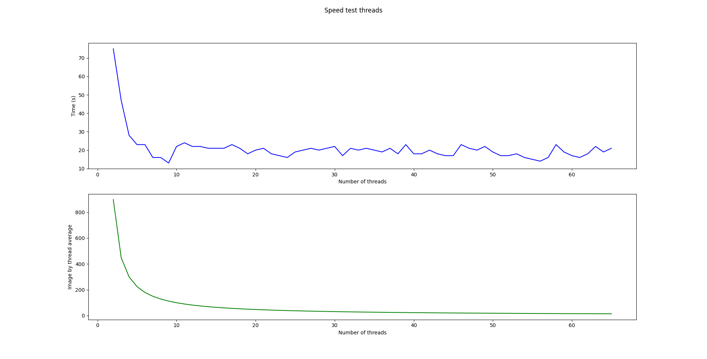
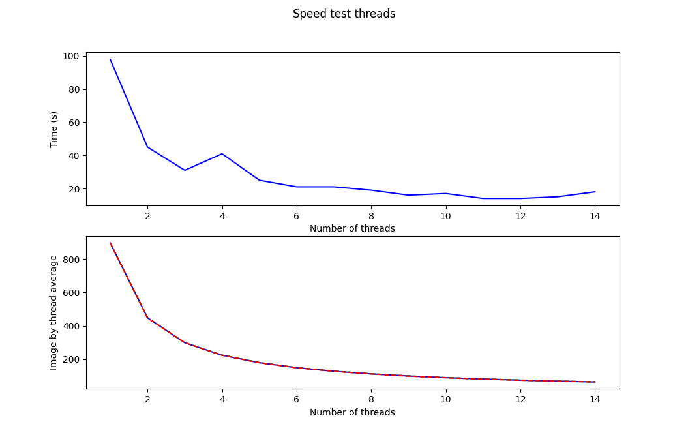
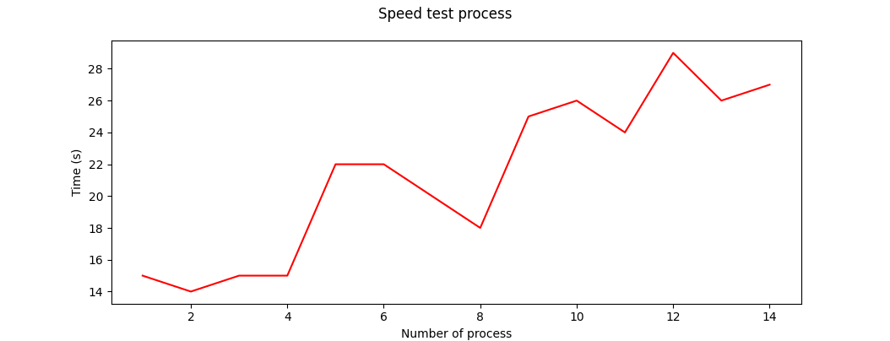

# Lab01 - Pokémon figure scraper

This is the second TP of the lesson "Concurrent system". In this exercise we need to test threads and process to download quickly 900 pictures of pokemon. The guideline is available [here](https://concurp.pages.forge.hefr.ch/2021-2022/labs/lab01/).

This project is made by @Simon.barras

## Launch app

```python3 pokemon.py [start_id [stop_id [tp [nbr_tp [out_dir]]]]]```

argument | description | default value
-------- | ----------- | -------------
pokemon.py | name of the python program file that contains the main entry point
start_id | the ID of the first image to download | 1
stop_id | the ID of the last image to download (included → the image with this ID must also be downloaded) | 898
tp | selector of multi-threading or multi-processing, T: threading, P: processing | T
nbr_tp | the number of threads or processes | 4
out_dir | the directory, where the files are written to | /tmp/

## pokemon.py

The code is documented but there is 2 workers. The used worker is _pokemon.worker(index)_ and this how it work:

### For example, we want to download 10 pictures with 4 threads

This is the load's repartition
> Jump = number of thread/process

Threads / process | Image
----------------- | -------
__TP 1__ | 0, 4, 8
__TP 2__ | 1, 5, 9
__TP 3__ | 2, 6
__TP 4__ | 3, 7

And here this is an example of the activity

Image | 0 | 4 | 2 | 1 | 3 | 5 | 7 | 8 | 9 | 6
----- | - | - | - | - | - | - | - | - | - | -
__TP 1__ | - | - | | | | |  | - | | |
__TP 2__ | | | | - | | - | | | - | |
__TP 3__ | | | - | | | | | | | -
__TP 4__ | | | | | - | | - | | | |

----------------------------- Time ---------------------------->

This version of the worker work well but if a process finish earlier as his _teammate_ he can't help them. To fix this, I have think about an algorithm where thread ask about the next image to download. The effect is that the images are downloaded in order but the thread/process aren't downloading the same number of images. If we retake the previous example we can have something like this:

Image | 0 | 1 | 2 | 3 | 4 | 5 | 6 | 7 | 8 | 9
----- | - | - | - | - | - | - | - | - | - | -
__TP 1__ | - | - | | | | |  | - | | |
__TP 2__ | | | | - | | - | | | - | - |
__TP 3__ | | | - | | | | | | | |
__TP 4__ | | | | | - | | - | | | |

----------------------------- Time ---------------------------->

The benefit is the time, if a thread is slower, all other may help him. The problem with this solution is the concurrent problem.

``` python
def worker_canHaveConcurrentProblem(index):
    global count_
    while count_ < args_['max_pokemon']:
        # Protection de la section critique
        count_ += 1
        #print("TD: " + str(index) + " is downloading " +str(count))
        try:
            download_image(count_, args_["path"], k_default_verbose)
        except Exception as e:
            continue
        if do_stats_:
            global tp_result_
            tp_result_[index] += 1
```

If there is a shift between `count_ += 1` and `download_image(count_, args_["path"], k_default_verbose)` the thread may not download the right image. We can see this effect with this picture:

When there are to many threads, the time isn't stable.

## Result

I have run experiment.py from my home and I have get this result:


> I have use _matplotlib_ to do this graph

For the threads, the time is always lower but from 8 there is no relevant improvement. This is due to the time to create the threads.
Compared to the threads, the process is faster but we can quickly see that the performance decreases.

## Conclusion

To summarize, we can save a lot of time with process and threads and the process are faster than threads but it's a big cost to create them.
The last interrogation is, why 1 process is faster than 1 thread 🤔?
