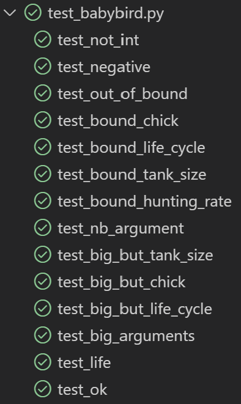
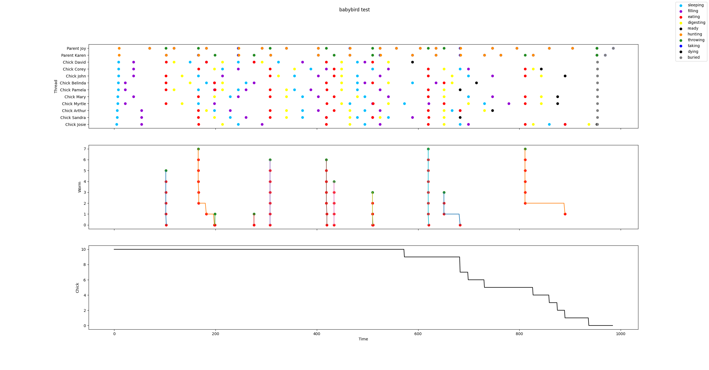

# Lab02 - The baby bird problem

This is the third TP of the lesson "Concurrent system". In this exercise we need to use semaphores to protect critical section and synchronize threads. The guideline is available [here](https://concurp.pages.forge.hefr.ch/2021-2022/labs/lab02/).

> This project is made by @Simon.barras

## Launch app

```shell
python3 babybird.py [chicks [baby_iter [max_food_size [hunting_success_rate]]]]
```

| argument                          | description                                                                                                                                                                                 | range      | default |
| --------------------------------- | ------------------------------------------------------------------------------------------------------------------------------------------------------------------------------------------- | ---------- | ------- |
| [babybird.py](../src/babybird.py) | name of the python program file that contains the main entry point                                                                                                                          |            |         |
| chicks                            | the number of chick processes                                                                                                                                                               | ≥1         | 17      |
| baby_iter                         | the number of iterations a baby chick does before it reaches adulthood and leaves the nest                                                                                                  | ≥1         | 53      |
| max_food_size                     | the maximum portion size a parent brings back from a hunt. This is at the same time also the maximum capacity a nest can contain (C)                                                        | ≥1         | 7       |
| hunting_success_rate              | represents the success rate a parent has when hunting. A rate of (for example) 25% means that quarter the time, a parent returns with some food. There is no percent sign after this number | 0≥rate≥100 | 50      |

## [Babybird](../src/babybird.py)

The code is commented but I want to explain my his structure.

### Architecture

For realising this Lab, I'have use _classes_, it's allows to code with object. I'have created 2 objects: _Chick_ & _Parent_.

This object use _Thread_ to run the routine of the parents or the chicks.

[![Class diagram](https://mermaid.ink/img/eyJjb2RlIjoiIGNsYXNzRGlhZ3JhbVxuICAgICAgTWFpblRocmVhZCAtLSogUGFyZW50IDogQXJyYXkgZ19wYXJlbnRzXG4gICAgICBNYWluVGhyZWFkIC0tKiBDaGljayA6IEFycmF5IGdfY2hpY2tzXG4gICAgICBjbGFzcyBNYWluVGhyZWFke1xuICAgICAgICAgIGludCBXQUlUX0JJUkRcbiAgICAgICAgICBpbnQgV0FJVF9NQVhcbiAgICAgICAgICBpbnQgTkJfT0ZfUEFSRU5UU1xuICAgICAgICAgIGludCBERUZBVUxUX05CX0NISUNLU1xuICAgICAgICAgIGludCBERUZBVUxUX0JBQllfSVRSXG4gICAgICAgICAgaW50IERFRkFVTFRfRk9PRF9DQVBBQ0lUWVxuICAgICAgICAgIGludCBERUZBVUxUX0hVTlRJTkdfUkFURVxuICAgICAgICAgIGludCBnX25iX2RheV90b19iZV9hX2NoaWNrZW5cbiAgICAgICAgICBpbnQgZ19uYl9vZl93b3JtXG4gICAgICAgICAgaW50IGdfZm9vZF9jYXBhY2l0eVxuICAgICAgICAgIGludCBnX2h1bnRpbmdfc3VjY2Vzc19yYXRlXG4gICAgICAgICAgU2VtYXBob3JlIHNlbV93YWl0X2VhdFxuICAgICAgICAgIFNlbXBhaG9yZSBsb2NrX3dvcm1fdGFua1xuICAgICAgICAgIFNlbXBhaG9yZSBsb2NrX3RhbmtfZmlsbFxuICAgICAgICAgIGJ1aWxkaW5nX25lc3QoY2hpY2tzLCBiYWJ5X2l0ciwgZm9vZF9jYXBhY2l0eSwgaHVudGluZ19zdWNjZXNzX3JhdGUpXG4gICAgICAgICAgbmFwKGJpcmRfc3BlZWQ6IGludClcbiAgICAgICAgICBzaW11bGF0aW5nKClcbiAgICAgICAgICBkZXN0cm95X25lc3QoKVxuICAgICAgICAgIG1haW4oYXJncylcbiAgICAgICAgICBwYXJzZV9hcmcoYXJndilcbiAgICAgICAgICBjaGVja19hcmcoaSwgYXJnKVxuICAgICAgfVxuICAgICAgY2xhc3MgUGFyZW50e1xuICAgICAgICAgIHN0ciBuYW1lXG4gICAgICAgICAgVGhyZWFkIHNwaXJpdFxuICAgICAgICAgIGZsb2F0IHNwZWVkXG4gICAgICAgICAgYm9vbCBoYXNfY2hpbGRcbiAgICAgICAgICBpbnQgaHVudGluZ19yZXN1bHRcbiAgICAgICAgICBfX2luaXRfXygpXG4gICAgICAgICAgYm9ybihuYW1lOiBzdHIpXG4gICAgICAgICAgdGhyZWFkJ3Mgd29ya2VyIC0-IGxpdmUoKVxuICAgICAgICAgIGh1bnQoKVxuICAgICAgICAgIGRlcG9zaXRfZm9vZCgpXG4gICAgICAgICAgcmVzdCgpXG4gICAgICAgICAgbW90aGVyc19zb3Jyb3coKVxuICAgICAgICAgIGZ1bmVyYWwoKVxuICAgICAgfVxuICAgICAgY2xhc3MgQ2hpY2t7XG4gICAgICAgICAgc3RyIG5hbWVcbiAgICAgICAgICBUaHJlYWQgc3Bpcml0XG4gICAgICAgICAgZmxvYXQgc3BlZWRcbiAgICAgICAgICBTZW1hcGhvcmUgbGl2ZVxuICAgICAgICAgIF9faW5pdF9fKClcbiAgICAgICAgICBib3JuKG5hbWU6IHN0cilcbiAgICAgICAgICB0aHJlYWQncyB3b3JrZXIgLT4gbGl2ZSgpXG4gICAgICAgICAgc2xlZXAoKVxuICAgICAgICAgIGdldF9mb29kKClcbiAgICAgICAgICBlYXQoKVxuICAgICAgICAgIGRpZ2VzdF9hbmRfX18oKVxuICAgICAgICAgIGxlYXZlX3RoZV9uZXN0KClcbiAgICAgICAgICBmYXJld2VsbF9wYXJ0eSgpXG4gICAgICAgICAgZnVuZXJhbCgpXG4gICAgICB9IiwibWVybWFpZCI6eyJ0aGVtZSI6ImRlZmF1bHQifSwidXBkYXRlRWRpdG9yIjpmYWxzZSwiYXV0b1N5bmMiOnRydWUsInVwZGF0ZURpYWdyYW0iOmZhbHNlfQ)](https://mermaid.live/edit#eyJjb2RlIjoiIGNsYXNzRGlhZ3JhbVxuICAgICAgTWFpblRocmVhZCAtLSogUGFyZW50IDogQXJyYXkgZ19wYXJlbnRzXG4gICAgICBNYWluVGhyZWFkIC0tKiBDaGljayA6IEFycmF5IGdfY2hpY2tzXG4gICAgICBjbGFzcyBNYWluVGhyZWFke1xuICAgICAgICAgIGludCBXQUlUX0JJUkRcbiAgICAgICAgICBpbnQgV0FJVF9NQVhcbiAgICAgICAgICBpbnQgTkJfT0ZfUEFSRU5UU1xuICAgICAgICAgIGludCBERUZBVUxUX05CX0NISUNLU1xuICAgICAgICAgIGludCBERUZBVUxUX0JBQllfSVRSXG4gICAgICAgICAgaW50IERFRkFVTFRfRk9PRF9DQVBBQ0lUWVxuICAgICAgICAgIGludCBERUZBVUxUX0hVTlRJTkdfUkFURVxuICAgICAgICAgIGludCBnX25iX2RheV90b19iZV9hX2NoaWNrZW5cbiAgICAgICAgICBpbnQgZ19uYl9vZl93b3JtXG4gICAgICAgICAgaW50IGdfZm9vZF9jYXBhY2l0eVxuICAgICAgICAgIGludCBnX2h1bnRpbmdfc3VjY2Vzc19yYXRlXG4gICAgICAgICAgU2VtYXBob3JlIHNlbV93YWl0X2VhdFxuICAgICAgICAgIFNlbXBhaG9yZSBsb2NrX3dvcm1fdGFua1xuICAgICAgICAgIFNlbXBhaG9yZSBsb2NrX3RhbmtfZmlsbFxuICAgICAgICAgIGJ1aWxkaW5nX25lc3QoY2hpY2tzLCBiYWJ5X2l0ciwgZm9vZF9jYXBhY2l0eSwgaHVudGluZ19zdWNjZXNzX3JhdGUpXG4gICAgICAgICAgbmFwKGJpcmRfc3BlZWQ6IGludClcbiAgICAgICAgICBzaW11bGF0aW5nKClcbiAgICAgICAgICBkZXN0cm95X25lc3QoKVxuICAgICAgICAgIG1haW4oYXJncylcbiAgICAgICAgICBwYXJzZV9hcmcoYXJndilcbiAgICAgICAgICBjaGVja19hcmcoaSwgYXJnKVxuICAgICAgfVxuICAgICAgY2xhc3MgUGFyZW50e1xuICAgICAgICAgIHN0ciBuYW1lXG4gICAgICAgICAgVGhyZWFkIHNwaXJpdFxuICAgICAgICAgIGZsb2F0IHNwZWVkXG4gICAgICAgICAgYm9vbCBoYXNfY2hpbGRcbiAgICAgICAgICBpbnQgaHVudGluZ19yZXN1bHRcbiAgICAgICAgICBfX2luaXRfXygpXG4gICAgICAgICAgYm9ybihuYW1lOiBzdHIpXG4gICAgICAgICAgdGhyZWFkJ3Mgd29ya2VyIC0-IGxpdmUoKVxuICAgICAgICAgIGh1bnQoKVxuICAgICAgICAgIGRlcG9zaXRfZm9vZCgpXG4gICAgICAgICAgcmVzdCgpXG4gICAgICAgICAgbW90aGVyc19zb3Jyb3coKVxuICAgICAgICAgIGZ1bmVyYWwoKVxuICAgICAgfVxuICAgICAgY2xhc3MgQ2hpY2t7XG4gICAgICAgICAgc3RyIG5hbWVcbiAgICAgICAgICBUaHJlYWQgc3Bpcml0XG4gICAgICAgICAgZmxvYXQgc3BlZWRcbiAgICAgICAgICBTZW1hcGhvcmUgbGl2ZVxuICAgICAgICAgIF9faW5pdF9fKClcbiAgICAgICAgICBib3JuKG5hbWU6IHN0cilcbiAgICAgICAgICB0aHJlYWQncyB3b3JrZXIgLT4gbGl2ZSgpXG4gICAgICAgICAgc2xlZXAoKVxuICAgICAgICAgIGdldF9mb29kKClcbiAgICAgICAgICBlYXQoKVxuICAgICAgICAgIGRpZ2VzdF9hbmRfX18oKVxuICAgICAgICAgIGxlYXZlX3RoZV9uZXN0KClcbiAgICAgICAgICBmYXJld2VsbF9wYXJ0eSgpXG4gICAgICAgICAgZnVuZXJhbCgpXG4gICAgICB9IiwibWVybWFpZCI6IntcbiAgXCJ0aGVtZVwiOiBcImRlZmF1bHRcIlxufSIsInVwZGF0ZUVkaXRvciI6ZmFsc2UsImF1dG9TeW5jIjp0cnVlLCJ1cGRhdGVEaWFncmFtIjpmYWxzZX0)

> Made with [Mermaid](https://mermaid.live/)

The _MainThread_ use the different classes to run this application. Each bird is simulating by an instance of one of those two classes and they are living her life until they finish.

[![Sequence diagram](https://mermaid.ink/img/eyJjb2RlIjoic2VxdWVuY2VEaWFncmFtXG4gICAgcGFydGljaXBhbnQgTWFpblRocmVhZFxuICAgIHBhcnRpY2lwYW50IENoaWNrc1xuICAgIHBhcnRpY2lwYW50IFBhcmVudHNcbiAgICBNYWluVGhyZWFkLT4-K0NoaWNrcyA6IGJvcm4obmFtZSlcbiAgICBNYWluVGhyZWFkLT4-K1BhcmVudHMgOiBib3JuKG5hbWUpXG4gICAgYWN0aXZhdGUgUGFyZW50c1xuICAgIHBhclxuICAgICAgICBNYWluVGhyZWFkLT4-Q2hpY2tzOiBmYXJ3ZWxsX3BhcnR5KClcbiAgICAgICAgbG9vcCBsaXZlXG4gICAgICAgICAgICBDaGlja3MtPj5DaGlja3M6IHNsZWVwXG4gICAgICAgICAgICBDaGlja3MtPj5DaGlja3M6IGdldF9mb29kXG4gICAgICAgICAgICBDaGlja3MtPj5DaGlja3M6IGVhdFxuICAgICAgICAgICAgQ2hpY2tzLT4-Q2hpY2tzOiBkaWdlc3RfYW5kX19fXG4gICAgICAgIGVuZFxuICAgICAgICBsb29wIGxpdmVcbiAgICAgICAgICAgIFBhcmVudHMtPj5QYXJlbnRzOiBodW50XG4gICAgICAgICAgICBQYXJlbnRzLT4-UGFyZW50czogZGVwb3NpdF9mb29kXG4gICAgICAgICAgICBQYXJlbnRzLT4-UGFyZW50czogcmVzdFxuICAgICAgICBlbmRcbiAgICAgICAgQ2hpY2tzLT4-Q2hpY2tzOiBsZWF2ZV90aGVfbmVzdCgpXG4gICAgICAgIENoaWNrcy0tPj4tTWFpblRocmVhZDogZmFyd2VsbF9wYXJ0eSgpXG4gICAgZW5kXG4gICAgTWFpblRocmVhZC0-PlBhcmVudHM6IG1vdGhlcnNfc29ycm93KClcbiAgICBkZWFjdGl2YXRlIFBhcmVudHNcbiAgICBNYWluVGhyZWFkLT4-Q2hpY2tzOiBmdW5lcmFsKClcbiAgICBNYWluVGhyZWFkLT4-UGFyZW50czogZnVuZXJhbCgpIiwibWVybWFpZCI6eyJ0aGVtZSI6ImRlZmF1bHQifSwidXBkYXRlRWRpdG9yIjpmYWxzZSwiYXV0b1N5bmMiOnRydWUsInVwZGF0ZURpYWdyYW0iOmZhbHNlfQ)](https://mermaid.live/edit#eyJjb2RlIjoic2VxdWVuY2VEaWFncmFtXG4gICAgcGFydGljaXBhbnQgTWFpblRocmVhZFxuICAgIHBhcnRpY2lwYW50IENoaWNrc1xuICAgIHBhcnRpY2lwYW50IFBhcmVudHNcbiAgICBNYWluVGhyZWFkLT4-K0NoaWNrcyA6IGJvcm4obmFtZSlcbiAgICBNYWluVGhyZWFkLT4-K1BhcmVudHMgOiBib3JuKG5hbWUpXG4gICAgYWN0aXZhdGUgUGFyZW50c1xuICAgIHBhclxuICAgICAgICBNYWluVGhyZWFkLT4-Q2hpY2tzOiBmYXJ3ZWxsX3BhcnR5KClcbiAgICAgICAgbG9vcCBsaXZlXG4gICAgICAgICAgICBDaGlja3MtPj5DaGlja3M6IHNsZWVwXG4gICAgICAgICAgICBDaGlja3MtPj5DaGlja3M6IGdldF9mb29kXG4gICAgICAgICAgICBDaGlja3MtPj5DaGlja3M6IGVhdFxuICAgICAgICAgICAgQ2hpY2tzLT4-Q2hpY2tzOiBkaWdlc3RfYW5kX19fXG4gICAgICAgIGVuZFxuICAgICAgICBsb29wIGxpdmVcbiAgICAgICAgICAgIFBhcmVudHMtPj5QYXJlbnRzOiBodW50XG4gICAgICAgICAgICBQYXJlbnRzLT4-UGFyZW50czogZGVwb3NpdF9mb29kXG4gICAgICAgICAgICBQYXJlbnRzLT4-UGFyZW50czogcmVzdFxuICAgICAgICBlbmRcbiAgICAgICAgQ2hpY2tzLT4-Q2hpY2tzOiBsZWF2ZV90aGVfbmVzdCgpXG4gICAgICAgIENoaWNrcy0tPj4tTWFpblRocmVhZDogZmFyd2VsbF9wYXJ0eSgpXG4gICAgZW5kXG4gICAgTWFpblRocmVhZC0-PlBhcmVudHM6IG1vdGhlcnNfc29ycm93KClcbiAgICBkZWFjdGl2YXRlIFBhcmVudHNcbiAgICBNYWluVGhyZWFkLT4-Q2hpY2tzOiBmdW5lcmFsKClcbiAgICBNYWluVGhyZWFkLT4-UGFyZW50czogZnVuZXJhbCgpIiwibWVybWFpZCI6IntcbiAgXCJ0aGVtZVwiOiBcImRlZmF1bHRcIlxufSIsInVwZGF0ZUVkaXRvciI6ZmFsc2UsImF1dG9TeW5jIjp0cnVlLCJ1cGRhdGVEaWFncmFtIjpmYWxzZX0)

> Made with [Mermaid](https://mermaid.live/)

For the _Chicks_, they release their semaphore with _leave_the_nest()_. When all semaphores are released, the _MainThread_ free the parents with _mothers_sorrow()_. The threads are closed with _funeral()_.

### Sempahores

For this project, we use 3 semaphores plus one sempahore for each chick. Here, I want to explain the flow of the 3 main semaphores.
[![sempahores's flow](https://mermaid.ink/img/eyJjb2RlIjoiZ3JhcGggVERcbiAgICBjb25kaXRpb257SWYgbmVzdCB0YW5rIGVtcHR5fVxuICAgIG5lc3QoKE5lc3QpKVxuICAgIGxvY2tfd29ybV90YW5rW2xvY2tfd29ybV90YW5rXVxuICAgIGxvY2tfdGFua19maWxsW2xvY2tfdGFua19maWxdXG4gICAgc2VtX3dhaXRfZWF0W3NlbV93YWl0X2VhdF1cbiAgICBwYXJlbnRzKChQYXJlbnRzKSlcbiAgICBjaGlja3MoKENoaWNrcykpXG5cbiAgICBuZXN0IC0tPiBjb25kaXRpb25cbiAgICBjb25kaXRpb24gLS0-fFlFUzogdW5sb2NrIHdvcm1fdGFua19maWxsfCBuZXN0XG4gICAgY29uZGl0aW9uIC0tPnxOT3wgbmVzdFxuXG4gICAgbG9ja193b3JtX3RhbmsgLS0-fGxvY2sgbG9ja193b3JtX3Rhbmt8IG5lc3RcbiAgICBuZXN0IC0tPnx1bmxvY2sgbG9ja193b3JtX3Rhbmt8IGxvY2tfd29ybV90YW5rXG5cbiAgICBsb2NrX3RhbmtfZmlsbCAtLi0-fGxvY2sgd29ybV90YW5rX2ZpbGx8IGxvY2tfd29ybV90YW5rXG4gICAgc2VtX3dhaXRfZWF0ID09PnwtMSBzZW1fd2FpdF9lYXR8IGxvY2tfd29ybV90YW5rXG4gICAgbG9ja193b3JtX3RhbmsgLS4tPnwreCBzZW1fd2FpdF9lYXR8IHNlbV93YWl0X2VhdFxuICAgIGxvY2tfd29ybV90YW5rID09PiBjaGlja3NcblxuICAgIHBhcmVudHMgLS4tPiBsb2NrX3RhbmtfZmlsbFxuICAgIGNoaWNrcyA9PT4gc2VtX3dhaXRfZWF0XG5cbiAgICBzZW1fd2FpdF9lYXQgLS4tPiBwYXJlbnRzIiwibWVybWFpZCI6eyJ0aGVtZSI6ImRlZmF1bHQifSwidXBkYXRlRWRpdG9yIjpmYWxzZSwiYXV0b1N5bmMiOnRydWUsInVwZGF0ZURpYWdyYW0iOmZhbHNlfQ)](https://mermaid.live/edit#eyJjb2RlIjoiZ3JhcGggVERcbiAgICBjb25kaXRpb257SWYgbmVzdCB0YW5rIGVtcHR5fVxuICAgIG5lc3QoKE5lc3QpKVxuICAgIGxvY2tfd29ybV90YW5rW2xvY2tfd29ybV90YW5rXVxuICAgIGxvY2tfdGFua19maWxsW2xvY2tfdGFua19maWxdXG4gICAgc2VtX3dhaXRfZWF0W3NlbV93YWl0X2VhdF1cbiAgICBwYXJlbnRzKChQYXJlbnRzKSlcbiAgICBjaGlja3MoKENoaWNrcykpXG5cbiAgICBuZXN0IC0tPiBjb25kaXRpb25cbiAgICBjb25kaXRpb24gLS0-fFlFUzogdW5sb2NrIHdvcm1fdGFua19maWxsfCBuZXN0XG4gICAgY29uZGl0aW9uIC0tPnxOT3wgbmVzdFxuXG4gICAgbG9ja193b3JtX3RhbmsgLS0-fGxvY2sgbG9ja193b3JtX3Rhbmt8IG5lc3RcbiAgICBuZXN0IC0tPnx1bmxvY2sgbG9ja193b3JtX3Rhbmt8IGxvY2tfd29ybV90YW5rXG5cbiAgICBsb2NrX3RhbmtfZmlsbCAtLi0-fGxvY2sgd29ybV90YW5rX2ZpbGx8IGxvY2tfd29ybV90YW5rXG4gICAgc2VtX3dhaXRfZWF0ID09PnwtMSBzZW1fd2FpdF9lYXR8IGxvY2tfd29ybV90YW5rXG4gICAgbG9ja193b3JtX3RhbmsgLS4tPnwreCBzZW1fd2FpdF9lYXR8IHNlbV93YWl0X2VhdFxuICAgIGxvY2tfd29ybV90YW5rID09PiBjaGlja3NcblxuICAgIHBhcmVudHMgLS4tPiBsb2NrX3RhbmtfZmlsbFxuICAgIGNoaWNrcyA9PT4gc2VtX3dhaXRfZWF0XG5cbiAgICBzZW1fd2FpdF9lYXQgLS4tPiBwYXJlbnRzIiwibWVybWFpZCI6IntcbiAgXCJ0aGVtZVwiOiBcImRlZmF1bHRcIlxufSIsInVwZGF0ZUVkaXRvciI6ZmFsc2UsImF1dG9TeW5jIjp0cnVlLCJ1cGRhdGVEaWFncmFtIjpmYWxzZX0)

> Made with [Mermaid](https://mermaid.live/)

| Lines   | Description   |
| ------- | ------------- |
| dotted  | parent's flow |
| bold    | chick's flow  |
| regular | both          |

| Case      | description |
| --------- | ----------- |
| Circle    | ressource   |
| rectangle | semaphore   |
| losange   | condition   |

This graph show the process and we can imagine how the threads are synchronised together. The threads are waiting on checkpoint (semaphore) until the others threads release them.

We can see that, the two semaphores with lock\_... are switches. They can be only On/Off. It's allow to accept only one thread at a time. On the contrary, the semaphore _sem_wait_eat_ is a counter of the number of worms in the tank. When a prent fill the tank, he release the semaphore the number of worm he found and every chick aquire the semaphore one time when he eat.

This graph didn't show the semaphores of the chicks. To finish the simulation, I used a sempahore for each chick. When the mainThread have realeased all the chick's semaphore, he notify the parent thread and bury all the birds.

> The activity is show with a graph [in the result](#result).

## [Test](../src/test_babybird.py)

I have write some tests to evaluate my program with different critical values.



### test_not_int

Try to put non insteger values. Every attempt must failed.

### test_negative

This test try to put negative values. Every attempt must failed.

### test_out_of_bound

Try to put values that aren't in the range for each arguments. Every attempt must failed.

### test_bound_XXX

Use some values that can be critic. This values are near 1 or the customs bounds.

### test_nb_argument

Try to run the files with different number of arguments.

### test_big_but_tank_size

This test run the programm with big arguments aside for the tank size.

### test_big_but_chick

This test run the programm with big arguments aside for the number of chicks.

### test_big_but_life_cycle

This test run the programm with big arguments aside for the life cycle.

### test_big_arguments

This test run the programm with big arguments.

### test_ok

Run the file with legal arguments. Store the result in a [log file](../src/log.txt). This file is use to create a graph that represent the activity of the nest.

### run_infinity

This test isn't run with _pytest_ because he is never stopping. I have run this by my own and I have analyzed the result in live. The chick are waiting to take food and the parent are living their life in an infinite loop.

## Result

I have write a little script that represent the activity of the nest like a profiler.



> I have made this graph with matplotlib

| Color  | Description |
| ------ | ----------- |
| Cyan   | Chick sleep (wait)                                    |
| Purple | Chick get one food (try to access to the ressource)   |
| Red    | Chick eat the food (wait)                             |
| Yellow | Chick digest (wait)                                   |
| Black  | Chick leave the nest (release his sempahore) / Parent are notify they are no more chick in the nest (stop his routine) |
| Orange | Parent hunt (wait and random value)                   |
| Green  | Parent try to put some food in the nest (try to access to the ressources)                                               |
| Blue   | Parents take a pause (wait)                           |
| Grey   | Finish the simulation (Parent and chikc's thread are joining)                                                         |

This graph is difficult to read but it show all the different activity of the nest. Each color's dot represents an action. The previous tab give some indications on what the methods is doing. Whene there is a _"(wait)"_, the method is just a timer.
In the middle, we can see the evolution of the worm's tank. Every time a parent fill this tank, all the chick wich are waiting on food are eating instantly. Near time 200, we can see that a parent was waiting on the chick to fill the tank.
The last graph display the number of chick in the nest. We can see that when the line rach 0, all the chick are buried (the chick thread are join) and the parent are finishing their routine before they are buried too.

## Conclusion

That was a very interesting lab. I was very happy to work on a little simulation like this and I think it's a great idea to learn sempahore with this problem. Personaly, I think I have understand semaphore well and I have also train the object orientation in python and my personal opinion is: Pyhton is a great language for all kind of prototypes and it work well with little project but I never recommend to a big application that use a lot of classes.

The nest update can be to use less semaphore for the ending the simulation. I can use only one semaphore and try to acquire the number of chick in the nest. All the chick will release this semaphore when they are leaving the nest. This new solution implemented in the branch [_chicksSemaphore_](https://gitlab.forge.hefr.ch/simon.barras/concurp-student-labs/-/tree/chicksSemaphore/lab02).
