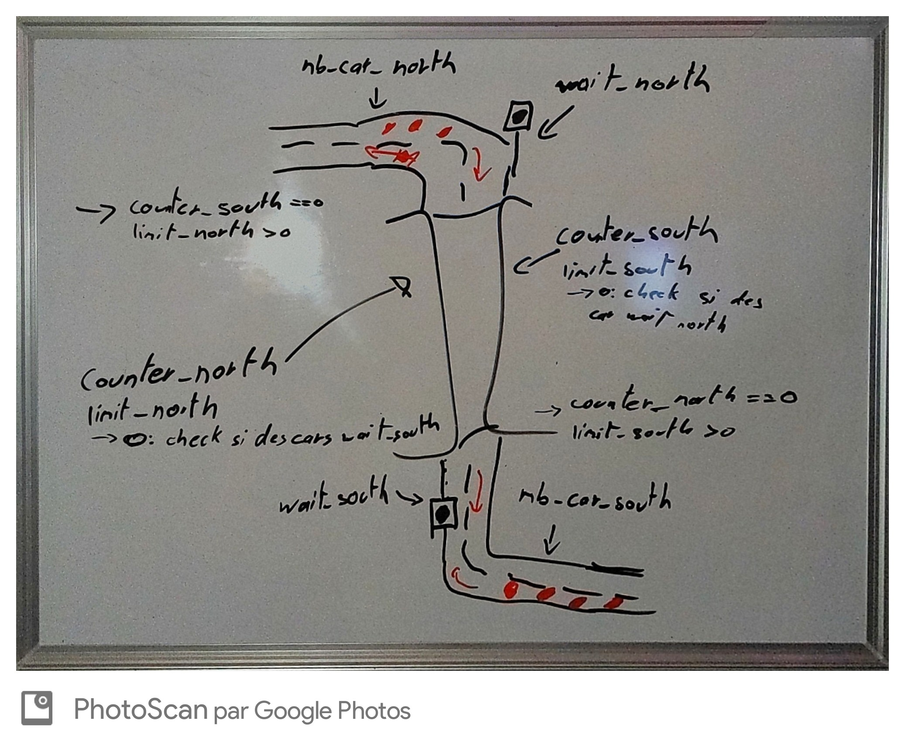

# The one-lane tunnel

This is the fifth TP of the lesson "Concurrent system". In this exercise we need to use a monitor to simulate a one-lane tunnel. This tunnel must be fair and avoid collision. The guideline is available [here](https://concurp.pages.forge.hefr.ch/2021-2022/labs/lab04/).

> This project is made by @Simon.barras

## Launch app

```shell
python3 .\lab04\src\tunnel.py -h
usage: tunnel.py [-h] [-N >= 0] [-S >= 0] [-n >= 1] [-s >= 1] [-L >= 1]

Simulation of a one-lane tunnel.

optional arguments:
  -h, --help  show this help message and exit
  -N >= 0     Number of cars going north
  -S >= 0     Number of cars going south
  -n >= 1     Number of time a car going north
  -s >= 1     Number of time a car going south
  -L >= 1     Max number of cars going in the same direction

Copyright 2021, School of Engineering and Architecture of Fribourg, Author: Simon Barras <simon.barras@edu.hefr.ch>
```

| argument                      | description                                                                                                                                                       | range | default |
| ----------------------------- | ----------------------------------------------------------------------------------------------------------------------------------------------------------------- | ----- | ------- |
| [tunnel.py](../src/tunnel.py) | name of the python program file that contains the main entry point                                                                                                |       |         |
| -N                            | The number of north bound vehicles                                                                                                                                | ≥ 0   | 29      |
| -n                            | The number of iterations north bound vehicles go through the tunnel                                                                                               | ≥ 1   | 23      |
| -S                            | The number of south bound vehicles                                                                                                                                | ≥ 0   | 31      |
| -s                            | The number of iterations south bound vehicles go through the tunnel                                                                                               | ≥ 1   | 19      |
| -L                            | Limit: if are vehicles waiting in the opposite direction, allow at most Limit vehicles to enter the bridge, and then change direction (this is to allow fairness) | ≥ 1   | 5       |

## [Tunnel](../src/tunnel.py)

The code is commented but I want to explain the purpose of this file.

This file is the main entry of the program, it contains the main function and he try to parse the arguments. If the arguments are not correct, the program will print the help message and exit and the error message is modified for the argument with somes classes.

## [TunnelMonitor](../src/tunnelmonitor.py)

This file containes the monitor and the vehicle class. This 2 class are used to simulate the tunnel, that say that all methods to access to the monitor or modify the state of the car are here.

### Monitor

To complete the due, we need to create a monitor who can check if a car cann pass or not.
Personnaly, I use 2 conditionnal variables for each entry. The first one is the number of car in the tunnel of a side and the second is the number of car before the tunnel will force change direction. We store the number of waitting car for each side.

To help me to think about the problem, I ve draw the sittuation and writed the condition on my whiteboard.


Each time a car would enter the tunnel, we add 1 to the number of waiting car and we check if the opposite counter is 0 and his bounde limit is greater than 0. When the car can pass, we remove one to the waitting car and we reset the opposite limit. We check if some car are waitting in the oder side. If yes, we remove 1 from the limit and if no, we notify all thread in this side.

## [Test](../src/test_tunnel.py)

I have write some tests to evaluate my program with different critical values.

> They all passed successfully !

## Conclusion

That was a very interesting lab and I'm always happy to work on little simulation. I found this one pretty difficult to understand and to deal with monitor but now I think I'm able to explain monitor to someone else.
There is one thing I've not been able is to fix and this is that car aren't overtaking in the tunnel. I speak with others students and we see thaht we need to use a different type of monitor to manage this point.
